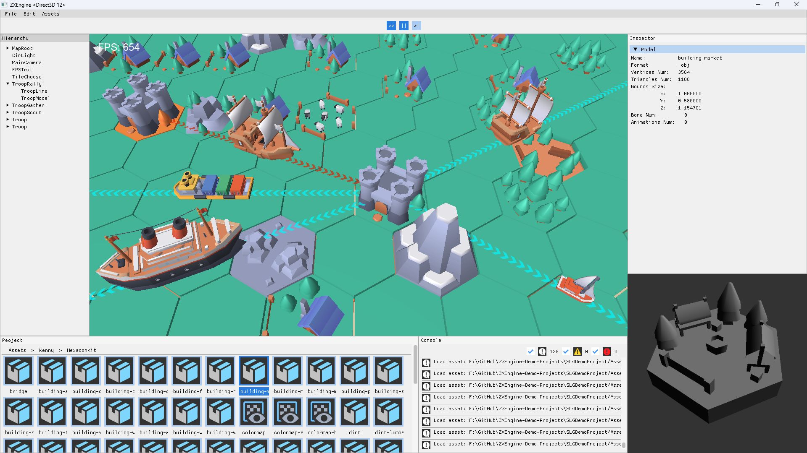
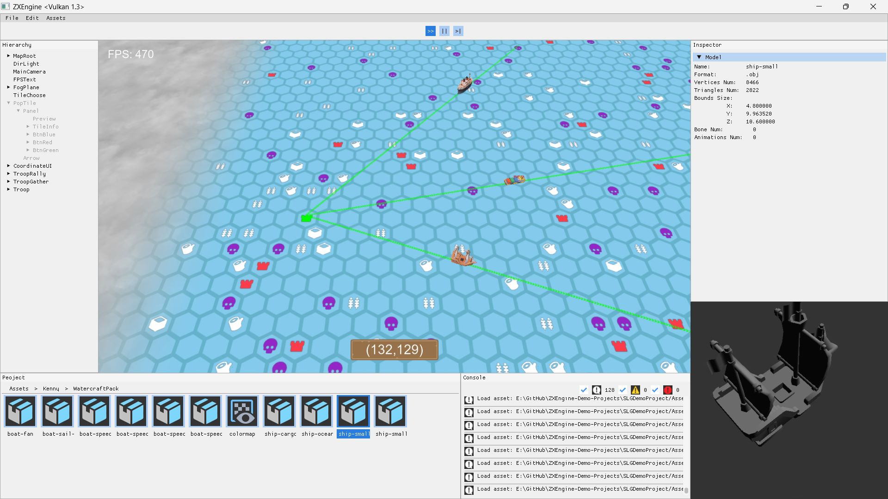
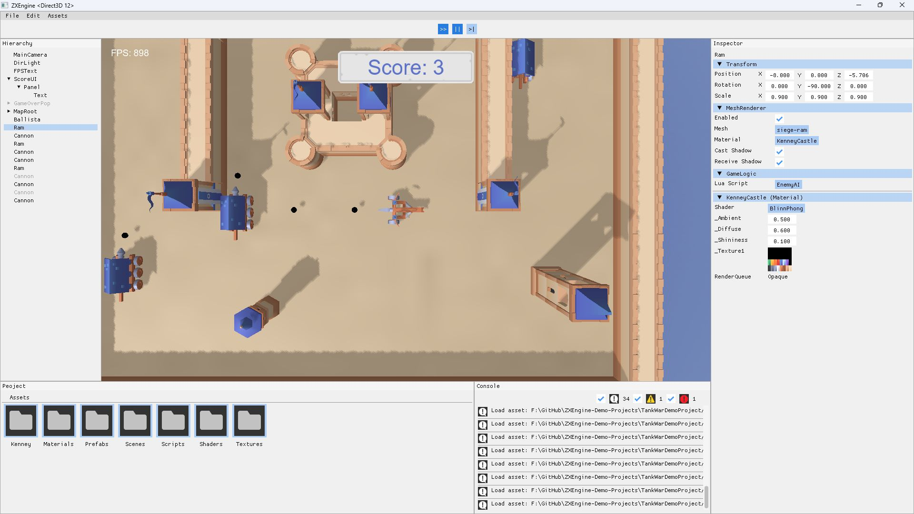

# ZXEngine-Demo-Projects
这个仓库存放的是一些使用ZXEngine制作的实际游戏Demo，以供大家参考。同时通过开发这些实际项目反过来完善引擎本身。目前有一个SLG Demo和一个中世纪主题的坦克大战Demo。

This repository contains some actual game demos made with ZXEngine for your reference. At the same time, by developing these actual projects, we can improve the engine itself. There is currently a SLG demo and a medieval-theme tank war demo.

## 目录 (Contents)

- [如何打开 (How To Open)](#如何打开-how-to-open)

- [SLG Demo](#slg-demo)

- [Tank War Demo](#tank-war-demo)

## 如何打开 (How To Open)

打开一个ZXEngine工程的方式有两种，第一种是使用ZXEngine Hub：

There are two ways to open a ZXEngine project. The first is to use ZXEngine Hub:


这个工具的仓库地址在这里：[ZXEngine Hub](https://github.com/AshenvaleZX/ZXEngine-Hub)，相关的介绍和使用说明在README文件中。

The repository of this tool is here: [ZXEngine Hub](https://github.com/AshenvaleZX/ZXEngine-Hub), the introduction and usage instructions are in the README file.

第二种方式是使用命令行，直接在ZXEngine后面加上要打开的工程路径，比如：

The second way is to use the command line and add the project path to be opened after ZXEngine, for example:

**Windows**

```shell
path/to/ZXEngine.exe  path/to/project
```

**macOS & Linux**

```sh
path/to/ZXEngine  path/to/project
```

**xmake**

```shell
xmake run zxengine path/to/project
```

## SLG Demo

游戏操作方式：鼠标拖动和点击

Game operation: mouse drag and click





## Tank War Demo

游戏操作方式：按WASD移动，空格开火

Game operation: press WASD to move, space to fire


