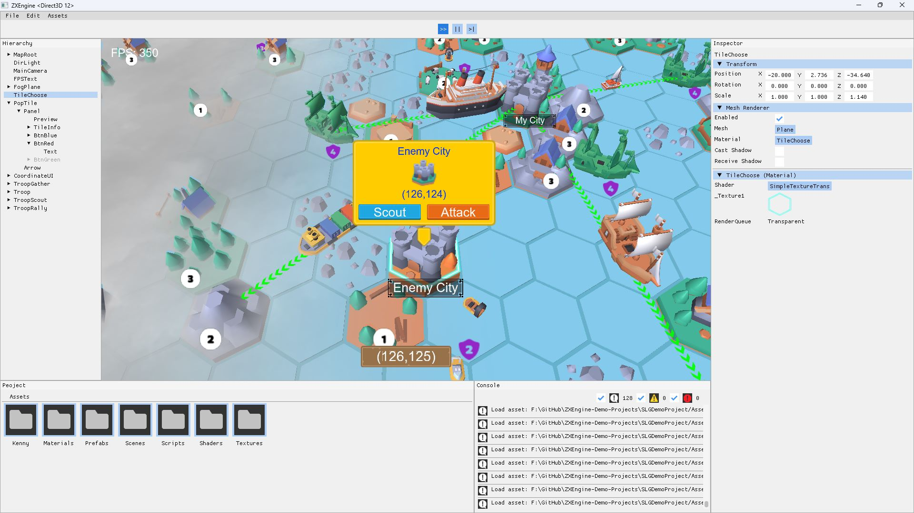

# ZXEngine-Demo-Projects
这个仓库存放的是一些使用ZXEngine制作的实际游戏Demo，以供大家参考。同时通过开发这些实际项目反过来完善引擎本身。目前暂时只有一个SLG游戏的大地图demo，以后会添加更多。

This repository contains some actual game demos made with ZXEngine for your reference. At the same time, by developing these actual projects, we can improve the engine itself. Currently there is only one SLG map demo, and more demos will be added in the future.

## 如何打开(How To Open)

用ZXEngine打开指定工程的方式目前只有命令行一种，后续会添加支持GUI的方式。命令行方式就是在ZXEngine后面跟一个工程路径，比如：

Currently, the only way to open a specified project with ZXEngine is to use the command line, and a GUI method will be added in the future. The command line method is to follow ZXEngine with a project path, such as:

**Windows**

```shell
path/to/ZXEngine.exe  path/to/project
```

**MacOS**

```sh
path/to/ZXEngine  path/to/project
```

**xmake**

```shell
xmake run zxengine path/to/project
```

## SLG Demo

Map demonstration:


